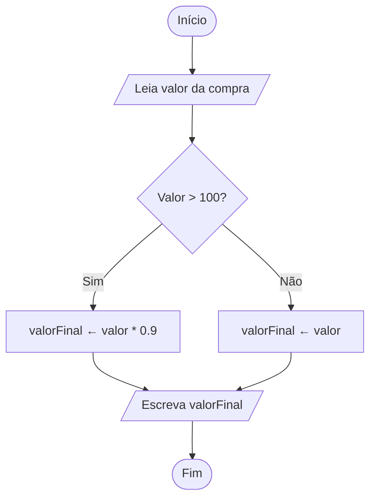

# Exercício 3 — Fluxograma: Desconto na Loja

## Fluxograma (Mermaid)



## Legenda dos símbolos

| Símbolo | Tipo | Significado |
|---------|------|-------------|
| Oval | Início / Fim | Delimita o algoritmo |
| Paralelogramo | Entrada / Saída | Leia valor / Escreva resultado |
| Losango | Decisão | Condição: Valor > 100? (Sim / Não) |
| Retângulo | Processo | Cálculo: aplicar desconto ou manter valor |

## Pseudocódigo equivalente

```
Início
    Leia valor
    Se (valor > 100) então
        valorFinal ← valor * 0.9
    Senão
        valorFinal ← valor
    FimSe
    Escreva valorFinal
Fim
```
